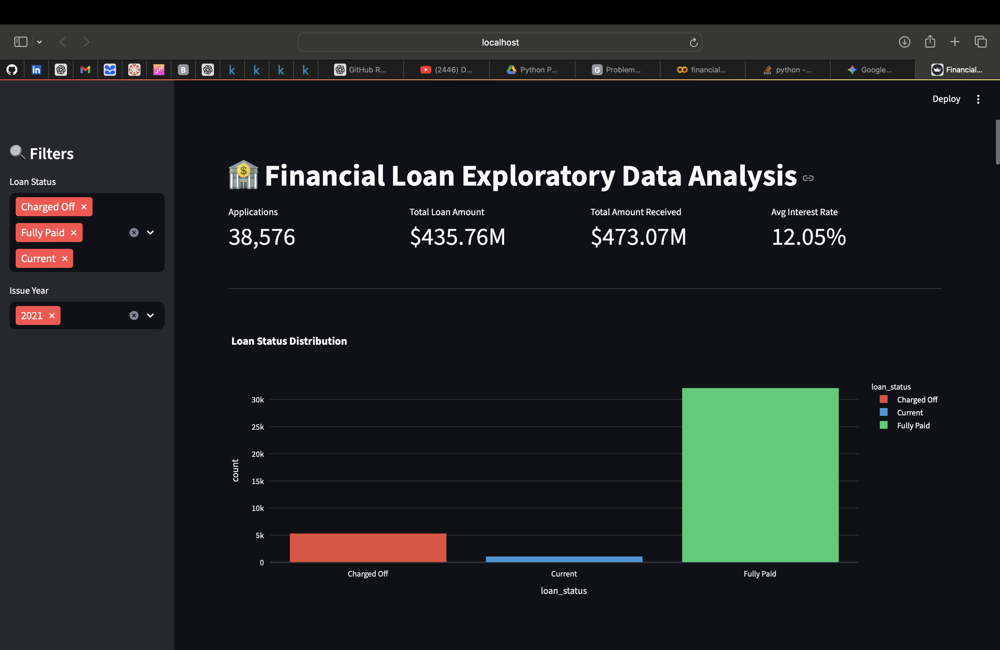
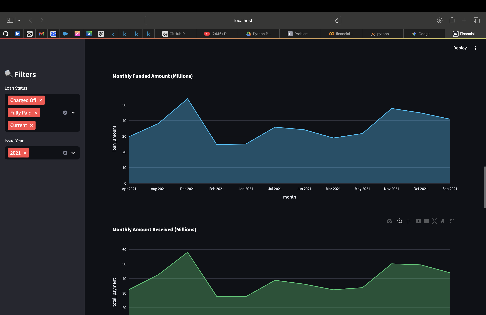
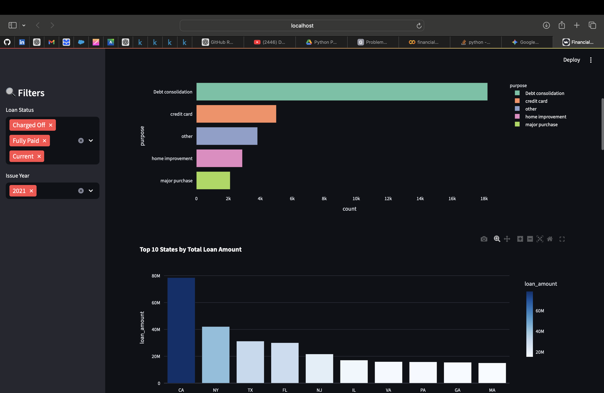

# Bank Loan Analysis (2021)

## 📌 Project Overview
This project analyzes bank loan application data to uncover trends, patterns, and key performance indicators related to loan approvals, funding, and borrower behavior. The analysis is performed using Python in a Jupyter Notebook and focuses on understanding loan distribution over time, borrower characteristics, and overall portfolio performance.

The primary notebook used in this repository is **financialLoanAnalysis2021.ipynb**.

---

## 🎯 Objectives
- Analyze total loan applications and funded amounts  
- Track loan trends by year and month  
- Understand borrower profiles such as employment length, home ownership, and loan purpose  
- Evaluate loan performance using key financial metrics  
- Support data-driven insights for banking and financial decision-making  

---

## 🗂️ Dataset Description
The dataset consists of historical bank loan application records with attributes including:
- Loan amount and funded amount  
- Interest rate and installment  
- Loan status (Fully Paid, Charged Off, Current)  
- Applicant information (employment length, annual income, home ownership)  
- Loan purpose and issue date  

Date fields are converted into datetime format and enhanced with year and month features to support time-series analysis.

---

## 🛠️ Tools & Technologies
- Python  
- Jupyter Notebook  
- Pandas – data manipulation  
- NumPy – numerical operations  
- Matplotlib / Seaborn – data visualization  
- Streamlit – dashboard development  

---

## 🔍 Analysis Workflow
1. Import required libraries  
2. Load and inspect the dataset  
3. Data cleaning and preprocessing  
4. Feature engineering (year and month extraction)  
5. Exploratory Data Analysis (EDA)  
6. Trend and performance analysis  
7. Visualization of key metrics  

---

## 📊 Key Analyses Performed
- Total number of loan applications  
- Monthly and yearly loan application trends  
- Total funded amount vs total received amount  
- Average interest rate and debt-to-income ratio  
- Distribution of loan status  
- Loan purpose and home ownership analysis  

---

## 📈 Insights & Outcomes
- Identified seasonal and yearly trends in loan applications  
- Highlighted the most common loan purposes across borrowers  
- Compared funded amounts with received amounts to assess portfolio performance  
- Evaluated loan health using loan status metrics  

These insights help financial institutions enhance risk assessment, portfolio monitoring, and strategic decision-making.

---

## 🚀 How to Use
1. Clone this repository  
2. Install the required Python libraries  
3. Open `financialLoanAnalysis2021.ipynb` in Jupyter Notebook  
4. Run all cells sequentially to reproduce the analysis  

---

## 🌐 Streamlit Dashboard & Project Links

### 🚀 Live Streamlit Dashboard
An interactive Streamlit dashboard was created to visualize key insights from the loan dataset.

🔗 **Dashboard Link:**  
[https://financialloananalysis.streamlit.app](https://financialloananalysis.streamlit.app)

---

### 📊 Streamlit Dashboard Preview

#### Dashboard Overview

#### Loan Trends Analysis

#### Loan Status Distribution

> 📌 *Note:* Ensure all dashboard screenshots are stored inside the `images/` folder and filenames match the paths above.

---

### 💻 GitHub Repository
Access the complete project source code and analysis here:

🔗 **GitHub Link:**  
[https://github.com/vinayakdon/Financial-Loan-Analysis](https://github.com/vinayakdon/Financial-Loan-Analysis)

---

## 👤 Author
Vinayak Shivappa Donawad

Developed as a data analysis project focused on financial and banking loan insights.

